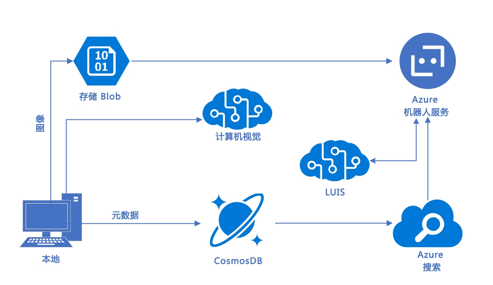

---
lab:
    title: '实验 1：简介'
    module: '模块 1:介绍 Azure 认知服务'
---

# 实验 1：简介

## 技术要求

### 模块：模块 01 - 介绍 Azure 认知服务

在这个实验中，我们将介绍我们的研讨会案例研究以及你的本地工作站和 Azure 实例中的设置工具，以便你可以在 Microsoft 认知服务套件中构建工具。

# 研讨会案例研究
## 方案

你已分配新客户 Adventure Works LLC，这个客户向其客户销售自行车和自行车装备。

Adventure Works Cycles 是一家大型跨国制造公司。它制造自行车和自行车组件，并通过互联网渠道和经销商分销网络向北美、欧洲和亚洲商业市场销售。它的总部设在华盛顿州柯克兰，拥有 290 名员工，而且在其整个市场群中设有多个区域销售团队。

在上一个财年取得成功后，Adventure Works 希望通过向现有客户销售额外产品来增加收入。去年，市场营销部门启动了一项计划，他们在各种贸易展览和赛车活动中手动收集了 Adventure Works 产品的产品评级数据。此数据当前保存在 Microsoft Excel 文件中。

他们已经证明，通过收集信息并手动分析评级结果，他们能够向现有客户群销售其他产品。市场营销团队希望通过在 Adventure Works 网站上创建联机版本的调查来扩展规模，但销售部门听说了他们所做的努力，并创建了在线调查。在此平台上进行的调查结果非常糟糕，并且字段与 Excel 文件中收集的数据不一致。

市场营销部门坚信他们可以使用评级数据来推荐其他产品，这是追加业务销售的机会。然而事实证明，在网站上进行调查并不是收集所需数据的好渠道，因此他们正在就如何改善这种情况寻求建议。此外，团队意识到手动执行分析将会随着客户的增加而变得更加困难。

 Adventure Works 旨在无缝扩展以处理大量使用各种语言的客户的查询。此外，他们希望创建一个可扩展的客户服务平台，以更深入地了解客户的需求、问题和产品评级。

此外，客户服务部门希望将其部分客户支持功能转移到交互式平台。目的是通过快速回答常见问题来减少员工的工作量并提高客户满意度。

### 解决方案

交互式平台被设想为一个机器人，它将包含以下功能：

- 检测客户语言（回复目前仅支持英语）

- 监控用户的情绪

- 允许上传图像并确定对象是否是自行车

- 将常见问题解答集成到聊天机器人中

- 根据机器人聊天中输入的文本确定用户意向

- 记录聊天机器人会话以供之后查看

## 体系结构

你的团队最近提出了获得 Adventure Works 批准的潜在体系结构（如下）：

* [文本分析](https://azure.microsoft.com/zh-cn/services/cognitive-services/text-analytics/)允许语言检测
* [计算机视觉](https://azure.microsoft.com/zh-cn/services/cognitive-services/computer-vision/)允许上传图像和检测内容
* [QnA Maker](https://azure.microsoft.com/zh-cn/services/cognitive-services/qna-maker/) 通过静态知识库促进机器人交互
* [LUIS](https://docs.microsoft.com/zh-cn/azure/cognitive-services/LUIS/Home)（语言理解智能服务）
从文本中提取意向和实体
* [Azure 机器人服务](https://azure.microsoft.com/zh-cn/services/bot-service/)连接器服务，可启用聊天机器人界面以利用应用智能
