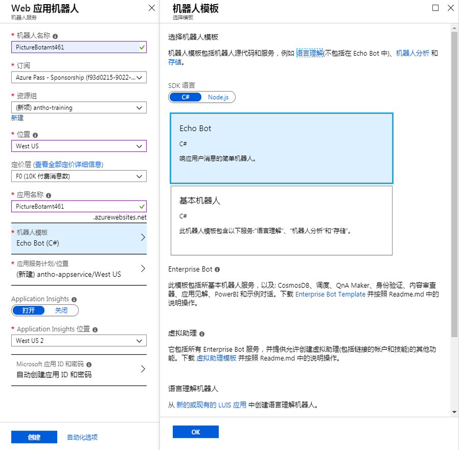
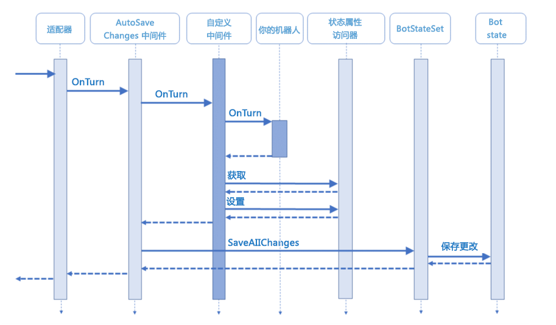

---
lab:
    title: '实验 3：基础筛选器机器人'
    module: '模块 2:创建机器人'
---

# 实验 3：创建基本筛选机器人

## 实验室 3.0 开始前的考虑事项

每一项新技术在带来许多机遇的同时也会带来许多问题，AI 支持的技术有其独特的注意事项。
在设计和实现 AI 工具时，请注意以下 AI 道德准则：

1. *公平性*：在不损害尊严的情况下最大限度地提高效率
1. *责任性*：AI 必须对其算法负责
1. *透明度*：防止偏见和对人类尊严的损害
1. *合乎道德的应用程序*：AI 必须帮助人类，并且针对智能隐私而设计

建议[阅读更多](https://ai-ethics.azurewebsites.net/)关于生成智能应用时的道德考虑因素。

## 实验 3.1：为机器人开发而设置

我们将使用最新的 .NET SDK (v4) 开发机器人。首先，我们需要下载 Bot Framework Emulator，并创建一个 Web App Bot 以及获取源代码。

请按照 [Lab1-Technical_Requirements.md](../Lab1-Technical_Requirements/02-Technical_Requirements.md) 中的相关指示下载 v4 SDK。

> **[2018/09/29] 重要说明！**
> 最近，适用于机器人框架的 v4 SDK [公开发布](https://github.com/Microsoft/botbuilder-dotnet)。如果要使用 v3 SDK（而不是 v4 SDK）完成本实验，请参阅[此处](./other-resources/sdk_v3_labs)，但请注意，我们不会继续维护 V3 实验室。

#### 下载 Bot Framework Emulator

请按照 [Lab1-Technical_Requirements.md](../Lab1-Technical_Requirements/02-Technical_Requirements.md) 中提供的指示下载 v4 预览版 Bot Framework Emulator，以便在本地测试机器人。

## 创建 Azure Web 应用机器人

使用 Microsoft Bot Framework 创建的机器人可以在任何可公开访问的 URL 上托管。  出于本实验的目的，我们将使用 [Azure 机器人服务](https://docs.microsoft.com/zh-cn/bot-framework/bot-service-overview-introduction)注册我们的机器人。

导航到门户。在门户中，单击“创建资源”并搜索“机器人”。选择“Web App Bot”，然后单击“创建”。对于名称，必须创建唯一标识符。我们建议使用类似 PictureBot[i][n] 的名称，其中 [i] 是你的姓名首字母缩写，[n] 是一个数字（例如，我的是 PictureBotamt6）。放在离你最近的区域。
对于定价层，选择 **“F0”**，因为它可以满足本实验室的全部需求。对于使用 **C#** 的 **Echo 机器人**，选择 **SDK v4** 作为机器人模板，我们会将这个代码更新为 PictureBot。配置新的应用服务计划（将其放在机器人所在的位置）。可以选择打开或关闭 Application Insights。**请勿** 更改或单击“自动创建应用 ID 和密码”，我们稍后会对此进行说明。单击“创建”。



部署后，请转到 Web 应用资源。你刚刚使用 Echo 机器人模板部署了非常简单的 EchoBot。部署后，可以根据需要选择“在 WebChat 中测试”选项卡，查看它可以执行哪些操作。

由于这不是我们要生成的完整机器人，因此下一步需要下载源代码。我们将在接下来的几个实验室中对其进行编辑，然后将其发布回这个服务。

导航到门户中的“生成”选项卡，然后选择“下载机器人源代码”。将它保存在方便的位置，并从 zip 文件中提取所有文件。

打开 Azure 门户时是执行以下操作的好时机：查找并保存位于 Web 应用机器人服务的 **“应用服务设置”>“应用程序设置”>“应用程序设置”** 部分 中的`botFilePath`和`botFileSecret`。

> 如果要在将来生成机器人，可以首先在门户中创建机器人并下载源代码（这是我们在此执行的操作），或者可以使用 Bot Builder 模板，我们已经提供了相关操作的说明：[Lab1-Technical_Requirements.md](../Lab1-Technical_Requirements/02-Technical_Requirements.md)

## 实验室 3.2：创建一个简单的机器人并运行它

>注意：在本实验室中，我们将为机器人设置代码和逻辑。你可能会在代码中看到一些适用于尚未涵盖的课程的主题（例如 LUIS）：我们将在后续课程中介绍此功能。

导航到刚刚创建的 Web 应用机器人的解决方案文件，并在 Visual Studio 中打开它（在将来的机器人中，可以使用 Visual Studio Code，但针对这些实验室，应该使用 Visual Studio）。花一些时间来看看你通过 Echo 机器人模板构建的所有不同的内容。我们不会花时间解释每个文件，但是我们 **强烈建议** **稍后** 花一些时间执行并查看这个示例（以及其他 Web 应用机器人示例 -  基础机器人），如果你还没有这么做的话。它包含机器人开发所需的重要、有用的 shell。可以在[此处](https://github.com/Microsoft/BotBuilder-Samples)找到它以及其他有用的 shell 和示例。

对于本实验室，我们将修改模板的各个方面以满足我们的需求，这也是你在实践中可能会进行的操作。

首先右键单击“解决方案”，然后选择“生成”。这个操作将加载包。接下来，在 appsettings.json 文件中，对它进行更新以包含以下内容，同时添加机器人服务信息：

```json
{
    "botFilePath": "YourBotFilePath",
    "botFileSecret": "YourBotFileSecret"
}
```

>重要提示：如果切换到其他机器人服务，则需要更新此信息

接下来，我们将重点介绍我们需要的 NuGet 包。在“解决方案资源管理器”中右键单击“解决方案”，然后选择“管理解决方案的 NuGet 包”。

#### 请勿更新 Microsoft.AspNetCore.All 或 Microsoft.AspNetCore - Start

在“已安装”选项卡中，按顺序将以下包 **更新到**`4.1.5`（这可能已经完成）：

>注意：本实验室尚未使用 4.1.5 以上版本进行测试

* Microsoft.Bot.Configuration
* Microsoft.Bot.Schema
* Microsoft.Bot.Connector
* Microsoft.Bot.Builder
* Microsoft.Bot.Builder.Integration.AspNet.Core

#### 请勿更新 Microsoft.AspNetCore.All 或 Microsoft.AspNetCore - Finish

接下来，单击“浏览”选项卡，然后安装下面列出的所有包。请确保选中“包含预发行版”框，并位于“浏览”选项卡上：

>注意：确保使用的是版本 4.1.5（如果可用）

* Microsoft.Bot.Builder.Azure
* Microsoft.Bot.Builder.AI.Luis
* Microsoft.Bot.Builder.Dialogs
* Microsoft.Azure.Search（使用最新版本）

最后，在“解决方案资源管理器”中，导航到 **“依赖项”>“NuGet”** 并删除以下包：

* [AsyncUsageAnalyzers](https://www.nuget.org/packages/AsyncUsageAnalyzers/)
* [StyleCop.Analyzers](https://www.nuget.org/packages/StyleCop.Analyzers)

还可以从根项目目录中删除“EchoBotWithCounter.ruleset”，因为这是使用包来创建的内容。这些可能是对于生产机器人有用的包，可以确保你已标准化编码和注释样式。本研讨会不会对它们进行探讨，但你可以通过上面提供的链接了解详细信息。

安装完成后，在“解决方案资源管理器 **”的“依赖项”>“NuGet”** 下，应该看到以下包：

```csharp
* Microsoft.AspNetCore
* Microsoft.AspNetCore.All
* Microsoft.Azure.Search
* Microsoft.Bot.Builder
* Microsoft.Bot.Builder.AI.Luis
* Microsoft.Bot.Builder.Azure
* Microsoft.Bot.Builder.Dialogs
* Microsoft.Bot.Builder.Integration.AspNet.Core
* Microsoft.Bot.Configuration
* Microsoft.Bot.Connector
* Microsoft.Bot.Schema
* Microsoft.Extensions.Logging.AzureAppServices
```

你可能知道，重命名 Visual Studio 解决方案/项目是一项非常敏感的任务。请 **仔细** 完成以下任务，使所有名称反映 PictureBot 而不是 EchoBot：

> 注意：在解析所有引用时，在 Visual Studio 中重命名文件最多可能需要 15 秒。如果没有为这个操作留出时间，则生成将失败，可能需要你手动解析重构的对象。请保持耐心。

1. 将解决方案和项目由“EchoBotWithCounter”重命名为“PictureBot”。关闭并重新打开 Visual Studio。
1. 打开 Program.cs，突出显示“BotBuilderSamples”，然后右键单击以选择“重命名”。选中这些框以重命名字符串和注释中的所有匹配项。将其重命名为 PictureBot 并选择“应用”。
1. 打开“属性”>“launchSettings.json”，将“EchoBotWithCounter”替换为“PictureBot”。
1. 打开“wwwroot”>“default.htm”，将“包含计数器的 Echo 机器人示例”和“包含计数器的 Echo 机器人”的匹配项替换为“PictureBot”。
1. 将“CounterState.cs”重命名为“PictureState.cs”

> 注意：通过右键单击文件并选择“重命名”来执行这个操作。将出现一个弹出窗口。选择“是”。**对要求重命名的每个文件执行这个操作。**


1. 打开“PictureState.cs”并确认类名为“PictureState”。如果不是，请突出显示“CounterState”并右键单击以选择“重命名”。选中这些框以重命名字符串和注释中的所有匹配项。将其重命名为 PictureState 并选择“应用”。
1. 将“EchoBotAccessors.cs”重命名为“PictureBotAccessors.cs”
1. 将“EchoWithCounterBot.cs”重命名为“PictureBot.cs”
1. 将“EchoBotWithCounter.deps.json”重命名为“PictureBot.deps.json”
1. 将“EchoBotWithCounter.runtimeconfig.json”重命名为“PictureBot.runtimeconfig.json”
1. 生成解决方案。

>**提示**：  如果你只有一台监视器，并且希望在指令和 Visual Studio 之间轻松切换，现在可以通过右键单击“解决方案资源管理器”中的“项目”，并选择 **“添加”>“现有项目”** 来将指令文件添加到 Visual Studio 解决方案。导航到“Lab2”，并添加“MD 文件”类型的所有文件。

#### 创建一个 Hello World 机器人

我们已更新基础 shell 以支持命名和将在其余实验室中使用的 NuGet 包，现在已准备好开始添加一些自定义代码。首先，我们将创建一个简单的“Hello world”机器人，它将帮助你熟悉如何使用 V4 SDK 生成机器人。

有一个重要的概念是“回合”，用于说明用户的消息和来自机器人的响应。
例如，如果我说“机器人你好”，并且机器人响应“嗨，你好吗？”，那就是 **一个** 回合。查看下面的图片，了解一 **个回合** 是如何在机器人应用程序的多个层中完成的。



对于本实验的这个部分，导航到 Startup.cs 中的 ConfigureServices 方法并为`CounterState = conversationState.CreateProperty<CounterState>(PictureBotAccessors.CounterStateName),`行添加注释（使用`//`）。我们将在后面部分讨论状态和访问器。

为了使“Hello world”正常运行，我们需要更新的唯一一个其他文件是“PictureBot.cs”。打开文件并查看注释。

对代码和注释有了一定程度的熟悉后，可使用下面的代码替换`OnTurnAsync`方法。
对话的每个回合都会调用这个方法。稍后你会明白为什么这个很重要，但是现在，请记住每个回合都会调用 OnTurnAsync。

```csharp
        /// <summary>
        /// 我们的 PictureBot 的每个对话回合将调用这个方法。
        /// 这里未使用对话框，因为它是“单回合”处理，表示单个
        /// 请求和响应。稍后，当我们添加对话框时，则必须在这个方法中导航。
        /// </summary>
        /// <param name=”turnContext”>A <see cref=”ITurnContext”/> 包含处理这个对话回合
        /// 所需的所有数据。</param>
        /// <param name=”cancellationToken”>（可选），<see cref=”CancellationToken”/>，可由其他对象
        /// 或线程使用以接收取消通知。</param>
        /// <returns><see cref=”Task”/>，表示排队待执行的工作。</returns>
        /// <seealso cref="BotStateSet"/>
        /// <seealso cref="ConversationState"/>
        /// <seealso cref="IMiddleware"/>
        public async Task OnTurnAsync(ITurnContext turnContext, CancellationToken cancellationToken = default(CancellationToken))
        {
            // 如果用户向我们发送消息
            if (turnContext.Activity.Type is "message")
            {
                {
                    await turnContext.SendActivityAsync($"Hello world.");
                }
            }
        }
```

现在通过按类似播放按钮的按钮来启动机器人（是否经过调试均可），它应该说“PictureBot”（或通过按键盘上的 F5）。NuGet 应会负责下载相应的依赖项。你可能会遇到一些断点，**删除它们**，然后选择“继续”（通过播放按钮）。

需要注意的一些事项：

* default.htm（在 wwwroot 下）页面将在浏览器中显示
* 记下网页的 localhost 端口号。这应该（并且必须）与模拟器中的终结点匹配。
* 你还将看到一个控制台窗口，如果使用的是 Visual Studio Code，则在你提交`dotnet run`后，该窗口将只是终端中的输出。对于这些实验室，你可以忽略它。

>卡住或中断？到目前为止，可以在 [resources/code/FinishedPictureBot-Part0](./code/FinishedPictureBot-Part0) 下找到适用于本实验室的解决方案。解决方案中的自述文件（你打开它后）将告诉你需要添加哪些密钥才能运行解决方案。

#### 使用 Bot Framework Emulator

要与机器人互动，需要执行以下操作：

* 启动 Bot Framework Emulator（注意，我们使用的是 v4 模拟器）。
* 在“欢迎”页面上选择“打开机器人”，然后导航到项目的根目录中以“.bot”结尾的文件。系统会要求你输入`botSecret`。
* 现在，应该可以单击消息选项卡（位于左侧菜单上）和“终结点”下列出的“开发”。还应该可以看到列出的“生产”终结点，我们接下来将对此进行讨论。
* 你现在应该能够与机器人对话。
* 键入“hello”，然后机器人将对每条消息回复“Hello World”。
* 可以选择“重新开始”以清除对话历史记录。


在日志中，你应该可以看到如下这类内容：


请注意它对我们将跳过 ngrok 以获取本地地址的描述。我们不会在本研讨会中使用 ngrok，但如果我们连接到已发布版本的机器人，我们会通过“生产”终结点来执行这个操作。打开“生产”终结点，观察不同环境中机器人之间的区别。在测试开发机器人并将它与生产机器人进行比较时，这可能是一个有用的功能。

可在[此处](https://docs.microsoft.com/zh-cn/azure/bot-service/bot-service-debug-emulator?view=azure-bot-service-4.0)阅读关于使用模拟器的详细信息。
> 题外话：为什么是这个端口号？  这是在你的项目属性中设置的。  在“解决方案资源管理器”中，双击 **“属性”>“调试”**，并检查其内容。应用 URL 是否与你在模拟器中连接的内容相匹配？

浏览并检查示例机器人代码。特别要注意的是：

* **Startup.cs** 是我们将添加服务/中间件并配置 HTTP 请求管道的位置。其中有很多注释可以帮助你了解正在进行的操作。请花几分钟阅读。

* 在 **PictureBot.cs** 中，`OnTurnAsync`是等待来自用户的消息的入口点，在`turnContext.Activity.Type is "message"`中，我们可以在收到消息后对消息做出响应并等待进一步的消息。  我们可以使用`turnContext.SendActivityAsync`将来自机器人的消息发送回给用户。

## 实验室 3.3：  管理状态和服务

再次导航到 Startup 类。请查看它（如果你还没有这样做）。然后，通过添加以下内容来更新`using`语句列表：

```csharp
using System.Text.RegularExpressions;
using Microsoft.Bot.Builder.AI.Luis;
```

我们暂时不会使用上述内容，但你可以猜一猜我们什么时候会用？

重点关注`ConfigureServices`方法，该方法用于向机器人添加服务。请仔细查看内容，注意内置内容。

> 有助于加深理解的一些其他注释：
>
> * 如果你不熟悉依赖关系注入，可以[在此阅读更多相关信息](https://docs.microsoft.com/zh-cn/aspnet/web-api/overview/advanced/dependency-injection)。
> * 出于本实验和测试目的，可以使用本地内存。对于生产，必须实现一种[管理状态数据](https://docs.microsoft.com/zh-cn/azure/bot-service/bot-builder-storage-concept?view=azure-bot-service-4.0)的方式。在`ConfigureServices`中的大量注释中，有一些相关提示。
> * 在方法的底部，你可能会注意到我们会创建并注册状态访问器。管理状态是创建智能机器人的关键，可以[在此阅读详细信息](https://docs.microsoft.com/zh-cn/azure/bot-service/bot-builder-dialog-state?view=azure-bot-service-4.0)。

幸运的是，这个 shell 非常全面，因此我们只需添加两个项目：中间件和自定义状态访问器。

#### 中间件

中间件是位于适配器和机器人逻辑之间的一个类或一组类，在初始化期间添加到适配器的中间件集合中。通过 SDK，可以编写你自己的中间件或添加由其他人创建的中间件的可重用组件。进出机器人的每个活动都会经过中间件。我们稍后会在实验室中进行深入了解，但是现在，请务必了解经过中间件的每个活动，因为它位于运行时调用的`ConfigureServices`方法中（该方法在由用户发送的每条消息和 OnTurnAsync 之间运行）。在`options.State.Add(conversationState);`之后的行上添加以下代码：

```csharp

                var middleware = options.Middleware;
                // 添加以下包含“middleware.Add(....”的中间件
                // 添加以下 Regex

```

#### 自定义状态访问器

在我们讨论需要的自定义状态访问器之前，请务必备份。我们将在下一部分中正式介绍对话框，它们是实现多回合对话逻辑的一种方法，这意味着它们需要依赖持续状态来了解用户在对话中的位置。在基于对话框的机器人中，我们将使用 DialogSet 来保存各种对话框。DialogSet 是使用名为“访问器”的对象的句柄创建的。

在 SDK 中，访问器实现`IStatePropertyAccessor`接口，这基本上意味着它提供了获取、设置和删除有关状态的信息的功能，因此我们可以跟踪用户在对话中位于哪个步骤。

对于我们创建的每个访问器，我们必须先为它赋予一个属性名称。对于我们的场景，我们想要跟踪一些内容：

1. `PictureState`
    * 我们问候用户了吗？
        * 我们不想多次问候他们，但我们希望确保在对话开始时问候他们。
    * 用户当前是否正在搜索特定的词？如果是，这个词是什么？
        * 我们需要跟踪用户是否已告知我们他们想要搜索的内容，以及搜索内容是什么（如果他们想要搜索）。
2. `DialogState`
    * 用户当前是否正在进行对话？
        * 我们将用它来确定用户在给定对话或对话流中的位置。如果你不熟悉对话框，请不要担心，我们很快就会对此进行介绍。

可以在下面的代码中看到，EchoBot 模板（我们使用的初始模板）有一个自定义状态访问器，它充当计数器以跟踪对话中的回合数（或“CounterState”）：

```csharp
                // 创建自定义状态访问器。
                // 状态访问器使其他组件能够读取和写入状态的各属性。
                var accessors = new PictureBotAccessors(conversationState)
                {
                    //CounterState = conversationState.CreateProperty<PictureState>(PictureBotAccessors.CounterStateName),
                };

                return accessors;
```

我们不会计算回合数，但我们可以使用类似的构造来跟踪我们称之为`PictureState`的内容。使用与`CounterState`相同的命名约定，在自定义状态访问器列表中添加`PictureState`。

最后，为了跟踪对话框，请使用内置的`DialogState`，方法是将以下行添加到自定义状态访问器列表中：

```csharp
                    DialogStateAccessor = conversationState.CreateProperty<DialogState>("DialogState"),
```

你应该可以在某些术语下面看到错误（红色波浪线）。但在修复它们之前，你可能想知道为什么我们必须创建两个访问器，为什么一个不够？

* `DialogState`是来自`Microsoft.Bot.Builder.Dialogs`库的特定访问器。发送消息时，对话框子系统将调用`DialogSet`上的`CreateContext`。跟踪这个上下文需要`DialogState`访问器来专门获取相应的对话框状态 JSON。
* 另一方面，`PictureState`将用于跟踪我们在整个对话中指定的特定对话属性（例如，我们是否已问候用户？）

> 现在不要担心对话术语，但这个过程应该有意义。如果你感到疑惑，可以[深入了解状态的运作方式](https://docs.microsoft.com/zh-cn/azure/bot-service/bot-builder-dialog-state?view=azure-bot-service-4.0)。

现在回到你看到的错误。你已经说过要存储这些信息，但是你还未说明存储位置或方式。我们必须更新“PictureState.cs”和“PictureBotAccessor.cs”才能拥有和访问我们想要存储的信息。

导航到“PictureState.cs”。我们在这里存储关于活动对话的信息。你会注意到，我们具有一个要存储的整数，名为`TurnCount`。你能猜出它在 EchoBotWithCounter 中的用途吗？

由于我们不跟踪回合，但要跟踪其他内容，因此请删除`TurnCount`并在它的位置添加：

```csharp
        public string Greeted { get; set; } = "not greeted";
        public string Search { get; set; } = "";
        public string Searching { get; set; } = "no";
```

可随时添加一些解释字符串用途的注释。正确初始化 PictureState 之后，可以更新 PictureBotAccessor，以删除在“Startup.cs”中遇到的错误。

导航到“PictureBotAccessors.cs”并找到`CounterStateName`和`CounterState`。使用为 CounterState 提供的内容作为模板，实现`PictureStateName`和`PictureState`所需的内容。

最后，添加以下代码，以便可以通过对话框状态使用`DialogSets`（稍后会进行说明）：

```csharp
        /// <summary> 获取用于 DialogState 访问器的 IStatePropertyAccessor{T} 名称。</summary>
        public static string DialogStateName { get; } = $"{nameof(PictureBotAccessors)}.DialogState";

        /// <summary> 为 DialogState 获取或设置 IStatePropertyAccessor{T}。</summary>
        public IStatePropertyAccessor<DialogState> DialogStateAccessor { get; set; }
```

需要将一个`using`语句添加到“PictureBotAccessor.cs”和“Startup.cs”- 你知道是哪个语句吗？这个包与包含许多用于构造对话框的工具的包相同。

想知道你是否已正确对它进行配置？返回“Startup.cs”并确认已解决有关创建自定义状态访问器的错误。

## 实验室 3.4：为机器人组织代码

有许多用于开发机器人的不同方法和首选项。通过 SDK，可以采用任何方式组织代码。在这些实验室中，我们将对话整理到不同的对话框中，并且将探索一种围绕对话的组织代码的 [MVVM 样式](https://msdn.microsoft.com/zh-cn/library/hh848246.aspx)。

这个 PictureBot 将按以下方式组织：

* **对话框** - 用于编辑模型的业务逻辑
* **响应** - 定义面向用户的输出的类
* **模型** - 要修改的对象

在我们开始之前，在项目中创建两个文件夹，“**响应**”和“**模型**”。（提示：可以右键单击项目并选择“添加”）。

#### 对话框

你可能已经熟悉对话框及其工作方式。如果你不熟悉，请阅读[关于对话框的这个页面](https://docs.microsoft.com/zh-cn/azure/bot-service/bot-builder-dialog-manage-conversation-flow?view=azure-bot-service-4.0&tabs=csharp)，然后再继续。

如果机器人能够执行多个任务，最好有多个对话框或一组对话框，以帮助用户浏览不同的对话流。对于 PictureBot，我们希望用户能够浏览初始菜单流（通常称为主对话框），然后分散到不同的对话框，具体取决于他们尝试进行的操作 - 搜索图片、分享图片、订购图片，或获取帮助。我们可以通过使用对话框容器或这里称为 `DialogSet` 的方式轻松完成此操作。请阅读关于如何[创建模块化机器人逻辑和复杂对话框](https://docs.microsoft.com/zh-cn/azure/bot-service/bot-builder-compositcontrol?view=azure-bot-service-4.0&tabs=csharp)的内容，然后再继续。

对于本实验室，我们将一切从简，但之后，你应该能够创建包含许多对话框的对话框集。对于 PictureBot，我们将有两个主对话框：

* **MainDialog** - 机器人启动时使用的默认对话框。这个对话框将根据用户请求启动其他对话框。作为对话框集的主对话框，这个对话框将负责创建对话框容器，并根据需要将用户重定向到其他对话框。
* **SearchDialog** - 一个对话框，用于管理处理搜索请求并将那些结果返回给用户。  *注意：我们将调用这个功能，但不会在本研讨会中实施搜索。*

由于我们只有两个对话框，因此可以保持简单，并将它们放在 PictureBot 类中。但是，在复杂的场景中，可能需要将它们拆分到一个文件夹的不同对话框中（类似于我们分离“响应”和“模型”那样）。

导航回 PictureBot.cs 并用以下内容替换 `using` 语句：

```csharp
using System.Threading;
using System.Threading.Tasks;
using Microsoft.Bot.Builder;
using Microsoft.Bot.Schema;
using Microsoft.Bot.Builder.Dialogs;
using Microsoft.Extensions.Logging;
using System.Linq;
using PictureBot.Models;
using PictureBot.Responses;
using Microsoft.Bot.Builder.AI.Luis;
using Microsoft.Azure.Search;
using Microsoft.Azure.Search.Models;
using System;
using Newtonsoft.Json;
using Newtonsoft.Json.Linq;
```

你刚刚添加了对模型/响应以及对服务 LUIS 和 Azure 搜索的访问权限。最后，Newtonsoft 引用将帮助你分析来自 LUIS 的响应，我们将在后续实验室中看到它。

接下来，我们需要将 `OnTurnAsync` 的当前方法替换为处理传入消息，然后在各种对话框中对其进行路由。

使用以下 shell 替换剩余的类：

```csharp
namespace Microsoft.PictureBot
{
    /// <summary>
    /// 表示处理传入活动的机器人。
    /// 对于每次用户交互，会创建这个类的实例并调用 OnTurnAsync 方法。
    /// 这是临时生存期服务。  在每次请求临时生存期服务时，
    /// 会进行创建。对于收到的每个活动，会创建这个类的
    /// 新实例。构造成本昂贵或生存期超过
    /// 单个回合的对象应谨慎管理。
    /// 例如，<see cref=”MemoryStorage”/> 对象和关联的
    /// <see cref=”IStatePropertyAccessor{T}”/> 对象在单一实例生存期创建。
    /// </summary>
    /// <seealso cref="https://docs.microsoft.com/zh-cn/aspnet/core/fundamentals/dependency-injection?view=aspnetcore-2.1"/>
    /// <summary>包含一组对话框和针对 picture 机器人的提示。</summary>
    公共类 PictureBot：IBot
    {
        private readonly PictureBotAccessors _accessors;
        // 初始化 LUIS 识别器

        private readonly ILogger _logger;
        private DialogSet _dialogs;

        /// <summary>
        /// 我们的 PictureBot 的每个对话回合将调用这个方法。
        /// 这里未使用对话框，因为它是“单回合”处理，表示单个
        /// 请求和响应。稍后，当我们添加对话框时，则必须在这个方法中导航。
        /// </summary>
        /// <param name=”turnContext”>A <see cref=”ITurnContext”/> 包含处理这个对话回合
        /// 所需的所有数据。</param>
        /// <param name=”cancellationToken”>（可选），<see cref=”CancellationToken”/> 可由其他对象
        /// 或线程使用以接收取消通知。</param>
        /// <returns><see cref=”Task”/>，表示排队待执行的工作。</returns>
        /// <seealso cref="BotStateSet"/>
        /// <seealso cref="ConversationState"/>
        /// <seealso cref="IMiddleware"/>
        public async Task OnTurnAsync(ITurnContext turnContext, CancellationToken cancellationToken = default(CancellationToken))
        {
            if (turnContext.Activity.Type is "message")
            {
                // 通过对话状态建立对话框上下文。
                var dc = await _dialogs.CreateContextAsync(turnContext);
                // 继续任何当前对话。
                var results = await dc.ContinueDialogAsync(cancellationToken);

                // 每个回合发送一个响应，因此，如果未发送响应，
                // 则表示当前没有处于活动状态的对话框。
                if (!turnContext.Responded)
                {
                    // 启动主对话框
                    await dc.BeginDialogAsync("mainDialog", null, cancellationToken);
                }
            }
        }
        /// <summary>
        /// 初始化 <see cref=”PictureBot”/> 类的新实例。
        /// </summary>
        /// <param name=”accessors”>包含用于管理状态的 <see cref=”IStatePropertyAccessor{T}/> 的类。</param>
        /// <param name=”loggerFactory”> <see cref=”ILoggerFactory”/>，连接到 Azure 应用服务提供程序。</param>
        /// <seealso cref="https://docs.microsoft.com/zh-cn/aspnet/core/fundamentals/logging/?view=aspnetcore-2.1#windows-eventlog-provider"/>
        public PictureBot(PictureBotAccessors accessors, ILoggerFactory loggerFactory /*, LuisRecognizer recognizer*/)
        {
            if (loggerFactory == null)
            {
                throw new System.ArgumentNullException(nameof(loggerFactory));
            }

            // 添加 LUIS 识别器的实例

            _logger = loggerFactory.CreateLogger<PictureBot>();
            _logger.LogTrace("PictureBot turn start.");
            _accessors = accessors ?? throw new System.ArgumentNullException(nameof(accessors));

            // DialogSet 需要 DialogState 访问器，它将在具有回合上下文时调用这个访问器。
            _dialogs = new DialogSet(_accessors.DialogStateAccessor);

            // 这个数组定义 Waterfall 的执行方式。
            // 我们可以在此定义不同的对话框及其步骤
            // 根据需要允许重叠。在这种情况下，这十分简单
            // 但在更复杂的情况下，可能需要将不同的
            // 对话框分离到不同的文件中。
            var main_waterfallsteps = new WaterfallStep[]
            {
                GreetingAsync,
                MainMenuAsync,
            };
            var search_waterfallsteps = new WaterfallStep[]
            {
                // 添加 SearchDialog water fall 步骤

            };

            // 将已命名的对话框添加到 DialogSet。这些名称保存在对话框状态中。
            _dialogs.Add(new WaterfallDialog("mainDialog", main_waterfallsteps));
            _dialogs.Add(new WaterfallDialog("searchDialog", search_waterfallsteps));
            // 以下行允许我们在对话框中使用提示
            _dialogs.Add(new TextPrompt("searchPrompt"));
        }
        // 添加 MainDialog 相关的任务

        // 添加 SearchDialog 相关的任务

        // 添加搜索相关的任务

    }

}
```

花一些时间与研讨会参与者一起回顾和讨论这个 shell。在继续之前，你应该了解每一行的用途。

我们稍后会对这个内容进行补充。你可以忽略任何错误（暂时）。

#### 响应

所以在填写对话框之前，我们需要准备一些响应。请记住，我们将把对话框和响应分开，因为这样会产生更简洁的代码，并且更易于遵循对话框的逻辑。如果你现在不同意或不理解，相信你很快就会同意和理解。

在“响应”文件夹中创建两个名为“MainResponses.cs”和“SearchResponses.cs”的类。你可能已经明白，响应文件将只包含我们想要发送给用户的不同输出，而不是逻辑。

在“MainResponses.cs”中添加以下内容：

```csharp
using System.Threading.Tasks;
using Microsoft.Bot.Builder;

namespace PictureBot.Responses
{
    public class MainResponses
    {
        public static async Task ReplyWithGreeting(ITurnContext context)
        {
            // 添加问候
        }
        public static async Task ReplyWithHelp(ITurnContext context)
        {
            await context.SendActivityAsync($"I can search for pictures, share pictures and order prints of pictures.");
        }
        public static async Task ReplyWithResumeTopic(ITurnContext context)
        {
            await context.SendActivityAsync($"What can I do for you?");
        }
        public static async Task ReplyWithConfused(ITurnContext context)
        {
            // 如果 Regex 或 LUIS 不知道用户要说什么
            // 请为用户添加回复
        }
        public static async Task ReplyWithLuisScore(ITurnContext context, string key, double score)
        {
            await context.SendActivityAsync($"Intent: {key} ({score}).");
        }
        public static async Task ReplyWithShareConfirmation(ITurnContext context)
        {
            await context.SendActivityAsync($"Posting your picture(s) on twitter...");
        }
        public static async Task ReplyWithOrderConfirmation(ITurnContext context)
        {
            await context.SendActivityAsync($"Ordering standard prints of your picture(s)...");
        }
    }
}
```

请注意，有两个不包含值的响应（ReplyWithGreeting 和 ReplyWithConfused）。根据需要填写这些内容。

在“SearchResponses.cs”中添加以下内容：

```csharp
using Microsoft.Bot.Builder;
using System;
using System.Collections.Generic;
using System.Linq;
using System.Threading.Tasks;
using Microsoft.Bot.Schema;

namespace PictureBot.Responses
{
    public class SearchResponses
    {
        // 添加名为“ReplyWithSearchRequest”的任务
        // 它应该考虑上下文并询问
        // 用户要搜索什么内容


        public static async Task ReplyWithSearchConfirmation(ITurnContext context, string utterance)
        {
            await context.SendActivityAsync($"Ok, searching for pictures of {utterance}");
        }
        public static async Task ReplyWithNoResults(ITurnContext context, string utterance)
        {
            await context.SendActivityAsync("There were no results found for \"" + utterance + "\".");
        }
    }
}
```

请注意，这里缺少一个完整的任务。根据需要填写，但请确保新任务的名称为“ReplyWithSearchRequest”，否则你之后可能会遇到问题。

#### 模型

由于时间限制，我们不会介绍如何创建所有模型。它们很简单，但我们建议你在添加代码后花些时间进行评审。右键单击“模型”文件夹并选择 **“添加”>“现有项目”**。导航到“代码/模型”，选择所有三个文件，然后选择“添加”。

此时，你的解决方案资源管理器应如下图所示：


你漏掉了什么内容吗？现在是检查你是否拥有所有文件的好时机，但可以忽略任何其他错误（暂时）。

### 实验室 3.5：Regex 和中间件

我们可以通过很多操作来改进机器人。首先，我们可能不想通过调用 LUIS 来获取简单的“搜索图片”消息，机器人将经常从其用户那里获得这个消息。  一个简单的正则表达式可以满足此需求，并节省我们的时间（由于网络延迟）和费用（调用 LUIS 服务产生的费用）。

此外，随着我们机器人复杂程度的加深，我们将接受用户的输入并使用多种服务来解释它，因此，我们需要一个过程来管理此流。  例如，首先尝试使用正则表达式，如果不匹配，则调用 LUIS，我们也可以继续尝试其他服务，例如 [QnA Maker](http://qnamaker.ai) 或 Azure 搜索。管理这个流的好方法是借助 [Middleware](https://docs.microsoft.com/zh-cn/azure/bot-service/bot-builder-concept-middleware?view=azure-bot-service-4.0)，SDK 可为这方面提供出色支持。

在继续进行实验之前，请了解有关中间件和 Bot Framework SDK 的详细信息：

1. [概述和架构](https://docs.microsoft.com/zh-cn/azure/bot-service/bot-builder-basics?view=azure-bot-service-4.0)
1. [中间件](https://docs.microsoft.com/zh-cn/azure/bot-service/bot-builder-concept-middleware?view=azure-bot-service-4.0)
1. [创建中间件](https://docs.microsoft.com/zh-cn/azure/bot-service/bot-builder-create-middleware?view=azure-bot-service-4.0&tabs=csaddmiddleware%2Ccsetagoverwrite%2Ccsmiddlewareshortcircuit%2Ccsfallback%2Ccsactivityhandler)

最终，我们将使用一些中间件来尝试先理解用户使用正则表达式 (Regex) 所说的内容，如果不能理解，我们将调用 LUIS。如果仍然不能理解，我们将继续并采用通用回复“I'm not sure what you mean”或者你为“ReplyWithConfused”设置的任何内容。

要将 Regex 的中间件添加到解决方案中，请创建一个名为“中间件”的新文件夹，并将“中间件”文件夹的内容（可以在 **“资源”>“代码”** 下找到这个内容）添加到解决方案。**还可以在未来的项目中使用这个中间件！**

在“Startup.cs”的 `ConfigureServices` 中的“添加以下 Regex”注释下，添加以下内容：

```csharp
                middleware.Add(new RegExpRecognizerMiddleware()
                .AddIntent("search", new Regex("search picture(?:s)*(.*)|search pic(?:s)*(.*)", RegexOptions.IgnoreCase))
                .AddIntent("share", new Regex("share picture(?:s)*(.*)|share pic(?:s)*(.*)", RegexOptions.IgnoreCase))
                .AddIntent("order", new Regex("order picture(?:s)*(.*)|order print(?:s)*(.*)|order pic(?:s)*(.*)", RegexOptions.IgnoreCase))
                .AddIntent("help", new Regex("help(.*)", RegexOptions.IgnoreCase)));

```

> 我们实际上只是粗略了解了如何使用正则表达式。如果你有兴趣，可以[在此处了解详细信息](https://docs.microsoft.com/zh-cn/dotnet/standard/base-types/regular-expression-language-quick-reference)。

如果没有添加 LUIS，我们的机器人实际上只会获取一些变体，但如果用户使用机器人搜索、共享和订购图片，它应该会捕获许多消息。

> 题外话：有人可能会争论说，用户应该不必键入“help”即可获得一个清楚明了的选项菜单，其中包含机器人可以执行的操作；更确切地说，这应该是第一次接触机器人时的默认体验。**可发现性** 是机器人面临的最大挑战之一 - 让用户了解机器人能够做什么。  优秀的[机器人设计原则](https://docs.microsoft.com/zh-cn/bot-framework/bot-design-principles)可能有所帮助。


## 实验室 3.6：运行机器人

#### 再次介绍 MainDialog

现在开始进入正题。我们需要在 PictureBot.cs 中填写 MainDialog，以便我们的机器人可以对用户所表达的他们想要执行的操作做出响应。

根据正则表达式的结果，我们需要将对话引向正确的方向。请仔细阅读代码以确认你了解它正在做什么，然后粘贴在 `// Add MainDialog-related tasks` 行下方的以下代码中：

```csharp
        // 如果我们还未问候用户，我们需要首先这样做，但是在后面的
        // 对话中，我们需要记住我们已经问候过用户了。
        private async Task<DialogTurnResult> GreetingAsync(WaterfallStepContext stepContext, CancellationToken cancellationToken)
        {
            // 获取对话中的当前步骤的状态
            var state = await _accessors.PictureState.GetAsync(stepContext.Context, () => new PictureState());

            // 如果我们还未问候用户
            if (state.Greeted == "not greeted")
            {
                // 问候用户
                await MainResponses.ReplyWithGreeting(stepContext.Context);
                // 将 GreetedState 更新为已问候
                state.Greeted = "greeted";
                // 将新的问候状态保存到对话状态
                // 这是为了确保在未来的回合中，我们不会重复问候用户
                await _accessors.ConversationState.SaveChangesAsync(stepContext.Context);
                // 询问用户他们下一步要做什么
                await MainResponses.ReplyWithHelp(stepContext.Context);
                // 由于我们未在这个步骤中明确提示用户，因此我们将结束对话
                // 当用户回复时，因为状态保持不变，因此 else 子句会将它们移动到
                // 下一个 waterfall 步骤
                return await stepContext.EndDialogAsync();
            }
            else // 我们已问候用户
            {
                // 转到下一个 waterfall 步骤，即 MainMenuAsync
                return await stepContext.NextAsync();
            }

        }

        // 这个步骤将用户路由到其他对话框
        // 在这种情况下，只有一个不同的对话框，因此较简单，
        // 但在较复杂的情况下，可以转到其他类似的对话框
        public async Task<DialogTurnResult> MainMenuAsync(WaterfallStepContext stepContext, CancellationToken cancellationToken)
        {
            // 检查我们当前是否正在处理用户的搜索
            var state = await _accessors.PictureState.GetAsync(stepContext.Context);

            // 如果正则表达式选取任何内容，请存储它
            var recognizedIntents = stepContext.Context.TurnState.Get<IRecognizedIntents>();
            // 根据已识别的意向，引导对话
            switch (recognizedIntents.TopIntent?.Name)
            {
                case "search":
                    // 切换到搜索对话框
                    return await stepContext.BeginDialogAsync("searchDialog", null, cancellationToken);
                case "share":
                    // 回复你正在共享照片
                    await MainResponses.ReplyWithShareConfirmation(stepContext.Context);
                    return await stepContext.EndDialogAsync();
                case "order":
                    // 回复你正在订购
                    await MainResponses.ReplyWithOrderConfirmation(stepContext.Context);
                    return await stepContext.EndDialogAsync();
                case "help":
                    // 显示帮助
                    await MainResponses.ReplyWithHelp(stepContext.Context);
                    return await stepContext.EndDialogAsync();
                default:
                    {
                        await MainResponses.ReplyWithConfused(stepContext.Context);
                        return await stepContext.EndDialogAsync();
                    }
            }
        }
```

点击 F5 运行机器人。通过发送诸如“help”、“share pics”、“order pics”和“search pics”之类的命令来测试它。如果唯一没有提供预期结果的命令是“search pics”，那么一切都是按照你的配置方式运行的。“search pics”失败目前是本实验室的预期行为，但这是为什么呢？请在继续之前提供一个答案！

>提示：从 PictureBot.cs 开始，使用断点跟踪与情况“搜索”的匹配。

>卡住或中断？到目前为止，可以在 [resources/code/FinishedPictureBot-Part1](./code/FinishedPictureBot-Part1) 下找到适用于本实验室的解决方案。解决方案中的自述文件（你打开它后）将告诉你需要添加哪些密钥才能运行解决方案。我们建议将它用作参考而不是解决方案来运行，但如果选择运行它，请确保添加必要的密钥（在本节中，应该只有机器人服务机密）。

 ### 延伸阅读

 要练习创建机器人，我们建议参阅 [.NET Bot Builder SDK 教程](https://docs.microsoft.com/zh-cn/azure/bot-service/dotnet/bot-builder-dotnet-sdk-quickstart?view=azure-bot-service-4.0)，并查看[机器人服务文档](https://docs.microsoft.com/zh-cn/azure/bot-service/bot-service-overview-introduction?view=azure-bot-service-4.0)。

要回顾机器人生成步骤，请参阅 [Bot Builder 基础知识](https://docs.microsoft.com/zh-cn/azure/bot-service/bot-builder-basics?view=azure-bot-service-4.0&tabs=cs)。