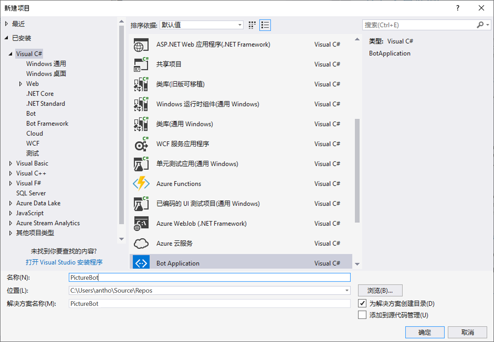
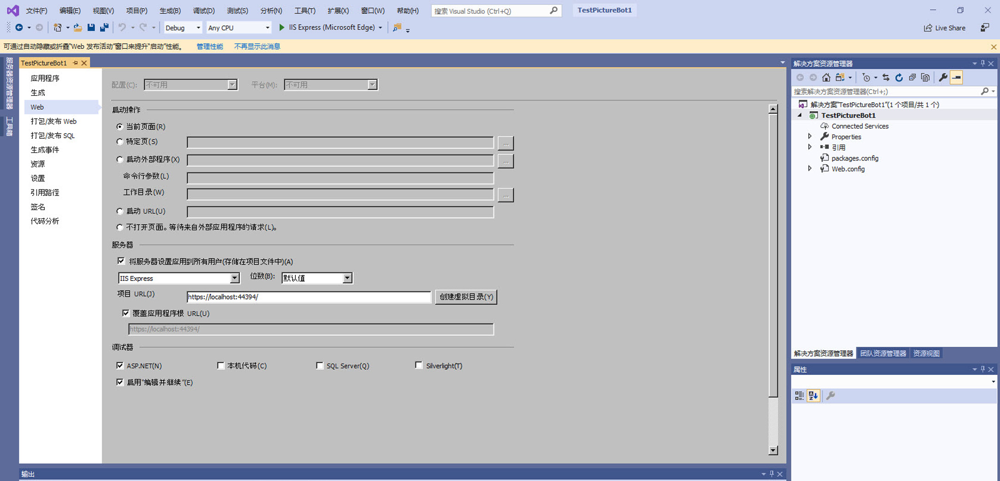

## 1_Regex_and_ScorableGroups：
预计用时：10-15 分钟

## 生成机器人

我们假设你曾接触过 Bot Framework。如果是，那非常好。如果没有，不要太担心，你将在本节中了解到许多相关的内容。我们建议完成[此 Microsoft 虚拟学院课程](https://mva.microsoft.com/zh-cn/training-courses/creating-bots-in-the-microsoft-bot-framework-using-c-17590#!)并查看[文档](https://docs.microsoft.com/zh-cn/bot-framework/)。

### 实验 1.1：为机器人开发而设置

我们将使用 C# SDK 来开发机器人。  首先，你需要准备两项内容：
1. Bot Framework 项目模板，可在[此处](http://aka.ms/bf-bc-vstemplate)下载。  此文件名为“Bot Application.zip”，你应将它保存到 \Documents\Visual Studio 2019\Templates\ProjectTemplates\Visual C#\ 目录中。  只需将整个压缩文件放在其中即可；无需解压缩。  
2. 在[此处](https://github.com/Microsoft/BotFramework-Emulator/releases/download/v3.5.33/botframework-emulator-Setup-3.5.33.exe) 下载用于本地测试机器人的 Bot Framework Emulator。  此仿真器会安装到 `c:\Users\`_your-username_`\AppData\Local\botframework\app-3.5.33\botframework-emulator.exe` 或 Downloads 文件夹，具体位置因浏览器而异。

### 实验 1.2：创建一个简单的机器人并运行它

在 Visual Studio 中，转到“文件”-->“新建项目”，并创建名为“PictureBot”的机器人应用程序。确保将其命名为“PictureBot”，否则稍后可能会遇到问题。  

 

>**“创建一个简单的机器人并运行它”** 这一实验剩下的部分是可选进行的。根据前提条件，你应该拥有使用 Bot Framework 的经验。可以按 F5 来确认它的构建是否正确，然后继续下一个实验。

浏览并检查示例机器人代码，这是一个回音机器人，它会重复你的消息及其字符长度。  特别要**注意**的是
+ 在 App_Start 下的 **WebApiConfig.cs** 中，路由模板是 api/{controller}/{id}，其中 id 是可选的。  这就是我们在调用机器人的终结点时始终会在末尾追加 api/messages 的原因。  
+ Controllers 下的 **MessagesController.cs** 是机器人的入口点。请注意，机器人可以响应许多不同的活动类型，并且发送消息将调用 RootDialog。  
+ 在 Dialogs 下的 **RootDialog.cs** 中，“StartAsync”是等待用户消息的入口点，而“MessageReceivedAsync”是处理接收到的消息，然后等待进一步消息的方法。  我们可以使用“context.PostAsync”将来自机器人的消息发回给用户。  

单击 F5 以运行示例代码。  NuGet 应会负责下载相应的依赖项。  

代码将在默认的 Web 浏览器中通过类似于 http://localhost:3979/ 的 URL 启动。  

> 有趣的是：为什么是这个端口号？  这是在你的项目属性中设置的。  在“解决方案资源管理器”中，双击“属性”，然后选择“Web”选项卡。  在“服务器”部分设置项目 URL。  

 

确保你的项目仍在运行（如果你停下来查看过项目属性，请再次按 F5），并启动 Bot Framework Emulator。  （如果你刚安装完毕，它可能没有被编入索引，无法显示在本地计算机上的搜索中，因此，请记住它安装在 c:\Users\your-username\AppData\Local\botframework\app-3.5.27\botframework-emulator.exe 中。）  确保机器人 URL 与上面代码启动的端口号相匹配，并且末尾追加有 api/messages。  你应该能够与机器人对话。  

 


### 实验 1.3：正则表达式和可得分组

我们可以进行许多操作来改进机器人。首先，我们可能不想只为了实现简单的问候“hi”而调用 LUIS，机器人将经常从它的用户那里收到此问候语。  一个简单的正则表达式可以满足此需求，并节省我们的时间（由于网络延迟）和费用（调用 LUIS 服务产生的费用）。  

此外，随着我们机器人复杂程度的加深，我们将接受用户的输入并使用多种服务来解释它，因此，我们需要一个过程来管理此流。  例如，首先尝试使用正则表达式，如果不匹配，则调用 LUIS，随后我们也可以继续尝试其他服务，例如 [QnA Maker](http://qnamaker.ai) 和 Azure 搜索。  管理此流的一个好方法是 [ScorableGroups](https://blog.botframework.com/2017/07/06/Scorables/)。  ScorableGroups 为你提供了一个属性，用于对这些服务调用强制执行排序操作。  在我们的代码中，让我们首先对正则表达式强制执行匹配顺序，然后调用 LUIS 来解释言语，最终，最低优先级为使用通用响应“I'm not sure what you mean”。    

若要使用 ScorableGroups，你的 RootDialog 需要从 DispatchDialog 而不是 LuisDialog 继承（但仍然可以在类上保留 LuisModel 属性）。  还需要一个对 Microsoft.Bot.Builder.Scorables（以及其他）的引用。  因此，请在 RootDialog.cs 文件中添加：

```csharp

using Microsoft.Bot.Builder.Scorables;
using System.Collections.Generic;

```

并将类派生更改为：

```csharp

    public class RootDialog : DispatchDialog<object>

```

接下来，删除类中的两个现有方法（StartAsync 和 MessageReceivedAsync）。 

让我们添加一些匹配正则表达式的新方法，将这些方法作为 ScorableGroup 0 中的首选方法。  在 RootDialog 类的开头添加以下内容：

```csharp

        [RegexPattern("^Hello|hello")]
        [RegexPattern("^Hi|hi")]
        [ScorableGroup(0)]
        public async Task Hello(IDialogContext context, IActivity activity)
        {
            await context.PostAsync("Hello from RegEx!  I am a Photo Organization Bot.  I can search your photos, share your photos on Twitter, and order prints of your photos.  You can ask me things like 'find pictures of food'.");
        }

        [RegexPattern("^Help|help")]
        [ScorableGroup(0)]
        public async Task Help(IDialogContext context, IActivity activity)
        {
            // 通过按钮菜单启动帮助对话  
            List<string> choices = new List<string>(new string[] { "Search Pictures", "Share Picture", "Order Prints" });
            PromptDialog.Choice<string>(context, ResumeAfterChoice, 
                new PromptOptions<string>("How can I help you?", options:choices));
        }

        private async Task ResumeAfterChoice(IDialogContext context, IAwaitable<string> result)
        {
            string choice = await result;
            
            switch (choice)
            {
                case "Search Pictures":
                    // PromptDialog.Text(context, ResumeAfterSearchTopicClarification,
                    //     "What kind of picture do you want to search for?");
                    break;
                case "Share Picture":
                    //await SharePic(context, null);
                    break;
                case "Order Prints":
                    //await OrderPic(context, null);
                    break;
                default:
                    await context.PostAsync("I'm sorry. I didn't understand you.");
                    break;
            }
        }

```

这段代码将匹配用户以“hi”、“hello”和“help”开头的表达。  选择 F5 并测试你的机器人。请注意，当用户寻求帮助时，我们会向他/她提供一个简单的按钮菜单，其中包含我们的机器人可以执行的三项核心操作：搜索图片、分享图片和下令打印。  

> 有趣的是：有人可能会争论说，用户应该不必键入“help”即可获得一个清楚明了的选项菜单，其中包含机器人可以执行的操作；更确切地说，这应该是第一次接触机器人时的默认体验。**可发现性** 是机器人面临的最大挑战之一 - 让用户了解机器人能够做什么。  优秀的[机器人设计原则](https://docs.microsoft.com/zh-cn/bot-framework/bot-design-principles)可能有所帮助。   

在 Scorable Group 1 中，如果没有匹配的正则表达式，当我们不得不使用 LUIS 进行第二次尝试时（稍后将进行），此设置会使操作更加简单。  


### 继续 [2_Azure_Search](./2_Azure_Search.md)  
返回 [README](./0_README.md)
