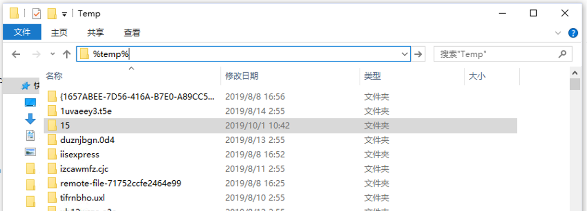

---
lab:
    title: '实验 4：记录聊天信息'
    module: '模块 2:创建机器人'
---

# 实验 4：记录聊天信息

> 前提条件：本实验假定你已在[实验 3](../Lab3-Basic_Filter_Bot/02-Basic_Filter_Bot.md) 中生成并发布了机器人。
建议执行该实验，这样才能实现本实验室中涵盖的记录。如果没有执行该实验，可以仔细阅读所有练习，并根据需要查看一些代码或者将代码用于自己的应用程序中。

## 实验 4.0：目标
本研讨会介绍如何使用 Microsoft Bot Framework 执行日志记录以及存储聊天对话的各个方面。完成这些实验后，你将能够：

- 了解如何拦截和记录机器人与用户的消息活动
- 将言语记录到文件存储

> 注意：在这些实验中，我们将使用 Microsoft Bot Framework SDK v4。如果要使用 SDK v3 执行类似的实验，请参阅[此处](./other-resources/SDK_V3_Labs)。

## 实验 4.1：拦截和分析消息

在本实验中，我们将介绍一些不同方式，我们将使用 Bot Framework 来拦截和记录机器人与用户的对话数据。我们先了解如何在不实现任何内存解决方案的情况下查看消息及消息内容。这样做有利于进行测试，但不适合生产环境。

接下来，我们将通过一个非常简单的实现来了解如何将会话中的数据写入文件。具体来说，我们将用户发送到机器人的消息放入列表中，并将列表以及一些其他项目存储在临时文件中（不过你可以根据需要将这个文件更改为特定的文件路径）

#### 使用 Bot Framework Emulator

我们来了解一下在不向机器人添加任何内容的情况下可以收集哪些信息来完成测试。

在 Visual Studio 中打开 PictureBot.sln。由于我们已发布了自己的机器人，我们需要向 `PictureBot.bot` 文件添加一些信息，以便在本地测试我们所做的更改。在该文件中，你应看到以下内容：

```html
{
  "name": "PictureBot",
  "secretKey": "",
  "services": [
    {
      "appId": "",
      "id": "http://localhost:3978/api/messages",
      "type": "endpoint",
      "appPassword": "",
      "endpoint": "http://localhost:3978/api/messages",
      "name": "PictureBot"
    }
  ]
}
```

从使用 v4 SDK 的模板开始时，以上就是文件中包含的内容。我们所要做的事情就是为发布机器人的 Azure 机器人服务添加 `appId` 和 `appPassword`。立即开始这样做。

运行你的机器人，并在 Bot Framework Emulator 中打开机器人，与在上述实验中执行的操作一样。

注意事项如下：
- 如果单击消息，则可以使用右侧的“Inspector-JSON”工具查看其关联的 JSON。单击消息并检查 JSON，以查看可以获取的信息。
- 右下角的“日志”包含对话的完整日志。我们将其分为五部分以进一步深入了解。
    - 你将看到的第一部分是仿真器正在侦听的端口
    - 你还可以看到 ngrok 正在收听的位置，并且可以使用“ngrok 流量检查器”链接检查 ngrok 的流量。但是，你应注意到，如果我们访问的是本地地址，我们将绕过 ngrok。**ngrok 仅用于参考，因为此研讨会不涉及远程测试**
    - 如果调用过程中出现错误（POST 200 或 POST 201 响应以外的任何内容），你可以单击该错误并在“Inspector-JSON”中查看非常详细的日志。根据错误类型，你甚至可以通过代码获取堆栈跟踪并尝试指出错误发生的位置。调试机器人项目时，这一点非常有用。
    - 调用 LUIS 时，你也可以看到一个 `Luis Trace`。如果单击 `trace` 链接，则可以看到 LUIS 信息。你可能会注意到，此特定实验中未设置此项。


可以在[此处](https://docs.microsoft.com/zh-cn/azure/bot-service/bot-service-debug-emulator?view=azure-bot-service-4.0)了解有关使用仿真器进行测试、调试和记录日志的更多信息。

## 实验 4.2：记录到文件中

> 注意：我们引用了[文档中的指南](https://docs.microsoft.com/zh-cn/azure/bot-service/bot-builder-howto-v4-state?view=azure-bot-service-4.0&tabs=csharp#file-storage)以确定本实验中提到的一些最佳做法。

内存存储提供程序使用内存内存储，重启机器人时其中的内容被会清理。这仅适用于测试目的。如果要保留数据但不想将机器人连接到数据库，则可以使用文件存储提供程序。虽然此提供程序也用于测试目的，但它会将状态数据保存到文件中，以便你可以检查该数据。使用 JSON 格式将数据写入文件。

由于我们希望每条消息都遵循此过程，因此我们将在 Startup 类中使用 `ConfigureServices` 方法，以将存储信息添加到文件中。打开该文件。请注意，目前我们正在使用：

```csharp
IStorage dataStore = new MemoryStorage();
```

with

```csharp
middleware.Add(new UserState<UserData>(dataStore));
middleware.Add(new ConversationState<ConversationInfo>(dataStore));
```

因此目前的实现使用内存内存储。同样，建议将此处的内存存储仅用于本地机器人调试。重启机器人时，将删除存储在内存中的所有内容。

若要将信息存储到临时文件中，需要将当前的 `IStorage` 行替换为：

```csharp
IStorage dataStore = new FileStorage(System.IO.Path.GetTempPath());
```

请添加上面的代码并运行机器人。在仿真器中，与机器人一起进行示例对话。

接下来，停止机器人，然后在 Windows 桌面中打开文件资源管理器。在位置栏中键入 `%temp%` 并按键盘上的 Enter。此操作将转到临时文件所在的位置。建议对内容进行排序，以便使最新的项位于顶部。

正在寻找的两个文件以“对话”和“用户”开头。



（使用 VSCode、Visual Studio、记事本或其他 JSON 编辑器/查看器）检查文件的内容。你在其中看到哪些内容？你期待/希望看到却未看到哪些内容？

## 实验 4.3：将言语记录到文件中

出于本实验的目的，我们将仅重点介绍如何更新“用户”文件。

接下来，我们可能想要添加用户发送到机器人的实际言语。这样做有助于确定用户尝试使用机器人完成的对话和操作类型。

可以通过更新在 PictureState.cs 中的 `UserData` 对象中存储的内容以及向 PictureBot.cs 中的对象添加信息来实现此目的。

在 PictureState.cs 中，**后跟** 以下代码：

```csharp
public class UserData
    {

        public string Greeted { get; set; } = "not greeted";
```

add:

```csharp
// 用户与机器人交谈的内容列表
public List<string> UtteranceList { get; private set; } = new List<string>();

```

在上面，我们简单地创建了一个列表，用于存储用户发送到机器人的消息。

在此示例中，我们选择使用状态管理器来读取和写入数据，但也可以选择[不使用状态管理器，直接从存储中读取和写入数据](https://docs.microsoft.com/zh-cn/azure/bot-service/bot-builder-howto-v4-storage?view=azure-bot-service-4.0&tabs=csharpechorproperty%2Ccsetagoverwrite%2Ccsetag)。


> 如果选择直接写入存储，则可以根据自己的方案设置 eTag。通过将 eTag 属性设置为 `*`，使机器人的其他实例可以覆盖以前写入的数据，即保留最后一次写入的数据。我们不会在此处对其进行介绍，但你可以[了解有关管理并发的更多信息](https://docs.microsoft.com/zh-cn/azure/bot-service/bot-builder-howto-v4-storage?view=azure-bot-service-4.0&tabs=csharpechorproperty%2Ccsetagoverwrite%2Ccsetag#manage-concurrency-using-etags)。

在运行机器人之前，要做的最后一件事是使用 `OnTurn` 操作将消息添加到列表中。打开 PictureBot.cs。

在 PictureBot.cs 中，**后跟** 以下代码：

```csharp
public async Task OnTurn(ITurnContext context)
{

    if (context.Activity.Type is ActivityTypes.Message)
    {
        // 从回合上下文中获取用户和对话状态。
        var state = UserState<UserData>.Get(context);
        var conversationInfo = ConversationState<ConversationInfo>.Get(context);
```

add:

```csharp
var utterance = context.Activity.Text;
state.UtteranceList.Add(utterance);
```

第一行接收用户传入的消息并将其存储在名为 `utterance` 的变量中。下一行将言语添加到在 PictureState.cs 中创建的现有列表中。

运行机器人并与机器人进行示例对话。停止机器人并检查以“用户”开头的最新临时文件。现在是什么情况？


>卡住或中断？此时，可以在 [/code/PictureBot-FinishedSolution-File](./code/PictureBot-FinishedSolution-File) 下找到实验的解决方案。你需要在 `appsettings.json` 文件中插入 Azure 机器人服务的密钥。建议使用此代码作为参考，而不是作为运行的解决方案，但如果选择运行此代码，请务必添加必需的密钥（在本节中，不应添加密钥）。


## 延伸阅读

若要将远程存储和测试合并到日志记录解决方案中，建议使用以下基于此解决方案的自引导教程：[添加 Azure 存储](https://github.com/Azure/LearnAI-Bootcamp/blob/master/lab02.5-logging_chat_conversations/2_Azure.md)和[将数据存储在 Cosmos 中](https://github.com/Azure/LearnAI-Bootcamp/blob/master/lab02.5-logging_chat_conversations/3_Cosmos.md)。
