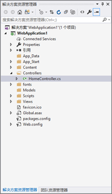
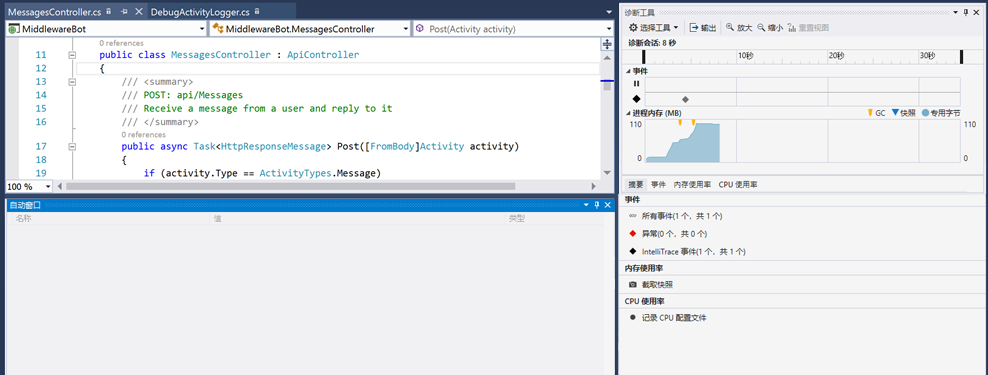

# 活动记录器

## 1. 目标

本实验的目的是开始使用 Microsoft Bot Framework 进行日志记录。具体来说，在本实中，我们将介绍如何使用活动记录器记录对话。本实验使用调试进行日志记录。

## 2. 设置

从 Visual Studio 中的 code\core-Middleware 导入 core-Middleware 代码。执行此操作的最简单方法是打开 core-Middleware.sln。解决方案资源管理器在 Visual Studio 中如下所示：



## 3. IActivityLogger

使用对话历史记录时最常见的操作之一是拦截和记录机器人与用户的消息活动。IActivityLogger 接口包含类需要实现才能记录消息活动的功能的定义。IActivityLogger 接口的 DebugActivityLogger 实现仅在调试中运行时才将消息活动写入跟踪侦听器。

````C#
public class DebugActivityLogger : IActivityLogger
{
    public async Task LogAsync(IActivity activity)
    {
        Debug.WriteLine($"From:{activity.From.Id} - To:{activity.Recipient.Id} - Message:{activity.AsMessageActivity().Text}");
    }
}
````
日志记录活动是在机器人应用程序的生命周期中发生的事件。Application_Start 方法在应用程序启动时调用，并持续应用程序整个生命周期。

Global.asax 允许我们编写对重要生命周期事件做出反应的事件处理程序。用户永远不会直接调用 Global.asax 事件。这些事件会自动调用以响应应用程序事件。对于本实验，我们必须在 Global.asax 下的 Application_Start 中注册 DebugActivityLogger，如下所示。

````C#
protected void Application_Start()
{
    Conversation.UpdateContainer(builder =>
    {
        builder.RegisterType<DebugActivityLogger>().AsImplementedInterfaces().InstancePerDependency();
    });
    GlobalConfiguration.Configure(WebApiConfig.Register);
}
````

在应用程序的生命周期内，Application_Start 方法仅被调用一次。此方法可用于执行启动任务。

## 4. 记录结果

在仿真器中运行机器人应用程序并使用消息进行测试。使用 Debug.WriteLine 写入日志数据。你可以在“输出”窗口中查看结果。确保选中了“调试”以*显示输出源*。如果看不到“输出”，请从菜单中选择“视图”->“输出”。你将看到一个条目，如 ````From:56800324 - To:2c1c7fa3 - Message:hello````。由于这是一个回声机器人，因此你也将看到记录的回应消息。



### 继续 [2_File_Logger](2_File_Logger.md)

返回 [0_README](../0_README.md)