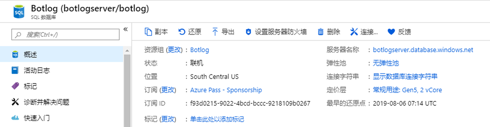
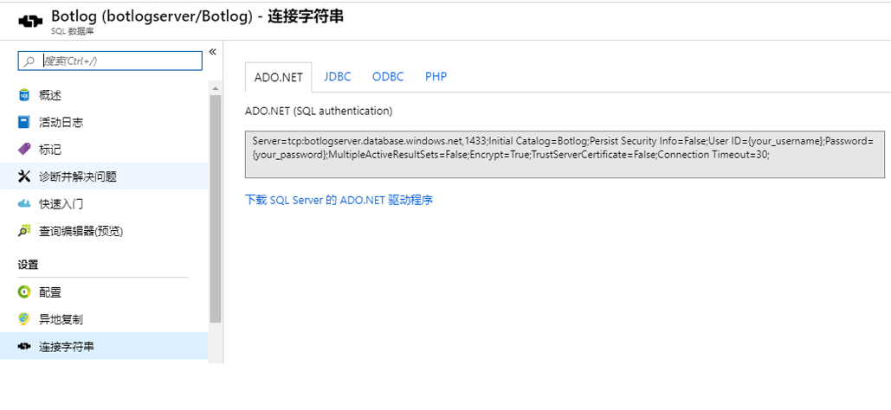
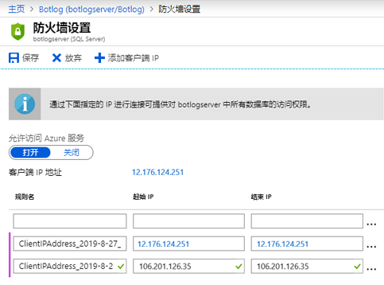
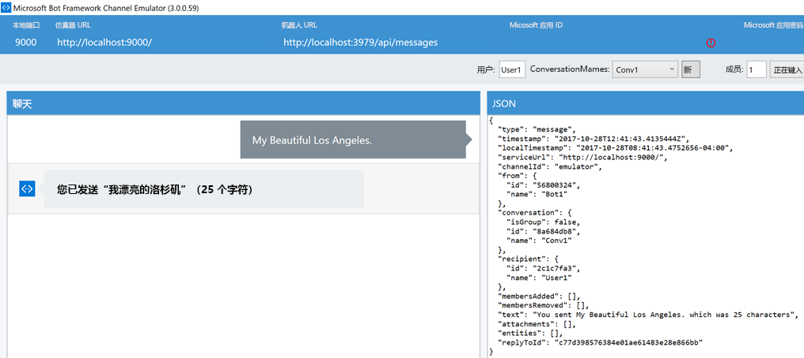
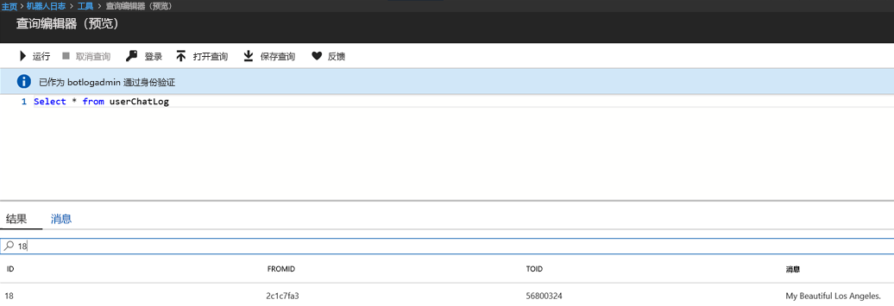

# SQL 记录器

## 1.	目标

本实验的目的是将聊天对话记录到 Azure SQL 数据库。本实验是上一个文件记录器实验的扩展，其中使用了 Global.asax 事件和 LogAsync 方法。

## 2.	设置/先决条件

2.1.   从 Visual Studio 中的 code\sql-core-Middleware 导入项目。

2.2.   因为我们将写入 SQL 数据库。要创建一个新的数据库，请转到 Azure 门户网站并按照[创建 DB - 门户](https://docs.microsoft.com/zh-cn/azure/sql-database/sql-database-get-started-portal) 步骤操作。但是创建的是名为 Botlog 的数据库，而不是链接中建议的“MySampleDatabase”。在该过程结束时，应会看到“概述”选项卡，如下图所示。



2.2.   从“概述”选项卡中选择“显示数据库连接字符串”并记下该连接字符串（粘贴在文本文档中），因为我们稍后将在实验中使用它。



2.3.   要捕获自己的 IP 地址，请更改防火墙设置。如果按照以下[创建 DB - 门户](https://docs.microsoft.com/zh-cn/azure/sql-database/sql-database-get-started-portal) 中的步骤操作，则你可能已经完成此操作。你的 IP 地址可在此处找到：https://whatismyipaddress.com/ 



2.4.   使用以下 create table 语句（或架构）创建一个名为 userChatLog 的新表。我们将使用[创建 DB - 门户](https://docs.microsoft.com/zh-cn/azure/sql-database/sql-database-get-started-portal) 链接中“查询 SQL 数据库”部分使用的相同工具。在 Azure 门户中，单击左侧菜单中的“数据资源管理器(预览)”。要登录，请使用在创建数据库时指定的相同帐户和密码。粘贴下面的脚本，然后单击“运行”。预期的结果是显示消息“查询成功: 受影响的行：0”。 

```
CREATE TABLE userChatLog(id int IDENTITY(1, 1),fromId varchar(max),toId varchar(max),message varchar(max),PRIMARY KEY(id));
```

2.5.   将 sql-core-Middleware 中的代码导入 Visual Studio。完成此操作最简单的方法是单击解决方案 sql-core-Middleware.sln。

## 3.  SQL 日志记录

该框架与上一个实验中使用的框架非常相似。简而言之，我们将使用 Global.asax 的全局事件来设置日志记录。执行此操作的理想方法是，通过 Application_Start 与 SQL Server 建立的连接，将连接对象传递给 LogAsync 方法以存储聊天消息并通过 Application_End 关闭连接。

````c#
public class WebApiApplication : System.Web.HttpApplication
    {
        SqlConnection connection = null;
        protected void Application_Start()
        {
            // 设置 sql 字符串连接
            SqlConnectionStringBuilder sqlbuilder = new SqlConnectionStringBuilder();
            sqlbuilder.DataSource = "botlogserver.database.windows.net";
            sqlbuilder.UserID = "botlogadmin";
            sqlbuilder.Password = "�";
            sqlbuilder.InitialCatalog = "Botlog";

            connection = new SqlConnection(sqlbuilder.ConnectionString);
            connection.Open();
            Debug.WriteLine("Connection Success");

            Conversation.UpdateContainer(builder =>
            {
                builder.RegisterType<SqlActivityLogger>().AsImplementedInterfaces().InstancePerDependency().WithParameter("conn", connection);
            });

            GlobalConfiguration.Configure(WebApiConfig.Register);
        }

        protected void Application_End()
        {
            connection.Close();
            Debug.WriteLine("Connection to database closed");
        }
    }
````

请务必注意，连接对象作为参数传递给上面代码片段中的 SqlActivityLogger。因此，LogAsync 方法现在可以记录来自机器人或用户的任何消息。可以从活动对象（activity.From.Id、activity.Recipient.Id、activity.AsMessageActivity().Text）获取发件人/收件人 id 以及聊天消息。

````c#
public class SqlActivityLogger : IActivityLogger
    {
        SqlConnection connection;

        public SqlActivityLogger(SqlConnection conn)
        {
            this.connection = conn;
        }
        public async Task LogAsync(IActivity activity)
        {
                string fromId = activity.From.Id;
                string toId = activity.Recipient.Id;
                string message = activity.AsMessageActivity().Text;

                string insertQuery = "INSERT INTO userChatLog(fromId, toId, message) VALUES (@fromId,@toId,@message)";
                
                // 将 fromId、toId、消息传递给用户 chatlog 表 
                SqlCommand command = new SqlCommand(insertQuery, connection);
                command.Parameters.AddWithValue("@fromId", fromId);
                command.Parameters.AddWithValue("@toId", toId);
                command.Parameters.AddWithValue("@message", message);
              
                // 插入 Azure sql 数据库
                command.ExecuteNonQuery();
                Debug.WriteLine("Insertion successful of message: " + activity.AsMessageActivity().Text);   
        }
    }
````

### SQL 注入 

SQL 注入是指注入攻击，其中攻击者可以执行控制应用程序数据库服务器的恶意 SQL 语句。SQL 注入可以为攻击者提供对敏感数据的未授权访问权限。在 LogAsync 方法中，参数可以防御 SQL 注入。参数化查询的主要好处是防止 SQL 注入。

## 4.  SQL 查询结果

从 Vsual Studio 运行项目并打开机器人仿真器。要测试 SQL 日志记录功能，请开始向机器人发送消息。



要预览存储在表中的日志消息，请在门户的“数据库”页中，选择“工具”->“查询编辑器(预览)”。要运行任何查询，请登录。
这是查看结果的便捷方法，但不是唯一的方法。要执行查询操作，请随意使用任意 SQL 客户端。要查看表 userChatLog 中插入的聊天，请运行查询 ````Select * from userChatLog````。在下面的例子中，同时记录通过机器人仿真器发送的消息 ````My Beautiful Los Angeles```` 与 id。




### 要查看实验并尝试额外的加分练习，请继续 [0_README](../0_README.md)