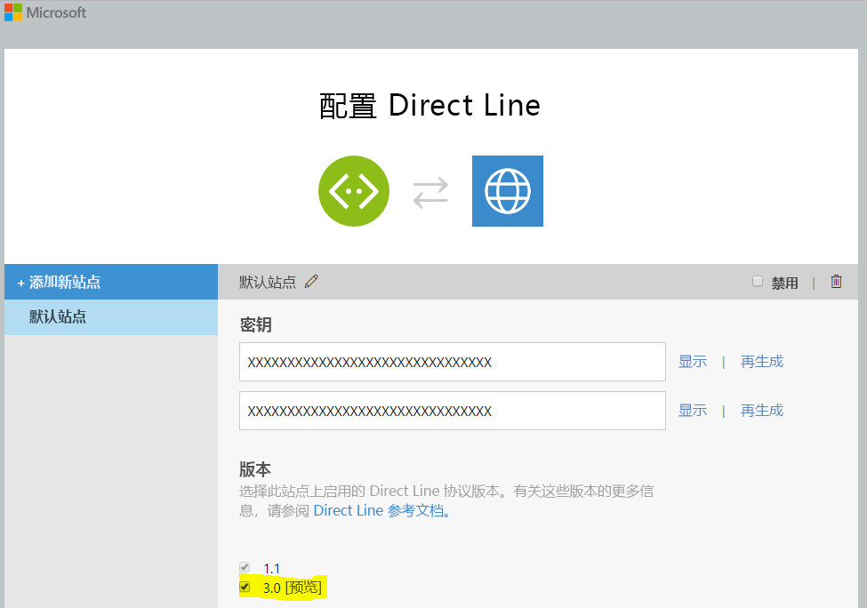
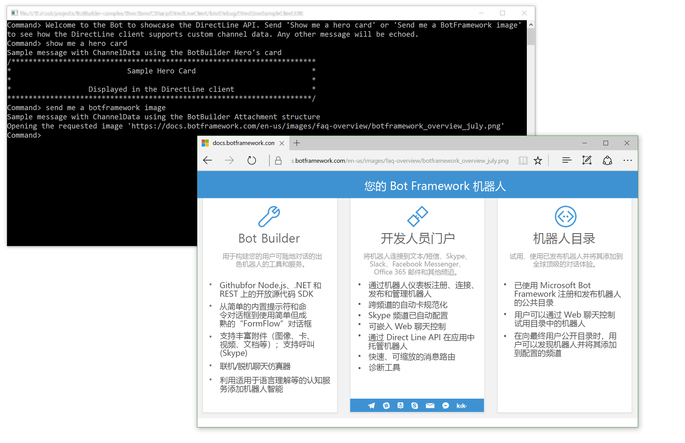

# Direct Line 机器人示例

使用 Direct Line API 相互通信的示例机器人和自定义客户端。

[![部署到 Azure][部署按钮]][部署 CSharp/DirectLine]

[部署按钮]：https://azuredeploy.net/deploybutton.png
[部署 CSharp/DirectLine]：https://azuredeploy.net

### 前提条件

运行此示例的最低要求：
* Visual Studio 2015 的最新更新。可在[此处](http://www.visualstudio.com)免费下载社区版。
* Bot Framework Emulator。要安装 Bot Framework Emulator，请在[此处](https://emulator.botframework.com/)下载。请查看[本文](https://github.com/microsoft/botframework-emulator/wiki/Getting-Started)，详细了解 Bot Framework Emulator。
* 向 Microsoft Bot Framework 注册机器人。请阅读[本文](https://docs.microsoft.com/zh-cn/bot-framework/portal-register-bot)，获取相关说明。完成注册后，使用注册的配置值（Bot Id、MicrosoftAppId 和 MicrosoftAppPassword）更新[机器人的 Web.config](DirectLineBot/Web.config#L9-L11) 文件

#### Direct Line API
Direct Line API 的凭据只能从 Bot Framework 开发人员门户获取并且仅允许调用者连接到生成的机器人。
在 Bot Framework 开发人员门户中，在通道列表中启用 Direct Line，然后配置 Direct Line 机密并在[客户端的 App.config](DirectLineClient/App.config#L4-L5) 文件中将其值更新为机器人 ID。请确认是否已勾选 3.0 版 [预览版] 的复选框。有关如何配置通道的更多信息，请参阅[本文](https://docs.microsoft.com/zh-cn/bot-framework/portal-configure-channels)。



#### 发布
此外，为了能够运行和测试此示例，你必须[发布机器人，例如发布到 Azure](https://docs.microsoft.com/zh-cn/bot-framework/publish-bot-overview)。或者，你可以使用 [Ngrok 与云端的本地机器人交互](https://blogs.msdn.microsoft.com/jamiedalton/2016/07/29/ms-bot-framework-ngrok/)。 

### 代码突出显示

Direct Line API 是一个简单的 REST API，用于直接连接到单个机器人。此 API 适用于编写自己的与机器人通信的客户端应用程序、Web 聊天控件或移动应用的开发人员。[Direct Line v3.0 Nuget 包](https://www.nuget.org/packages/Microsoft.Bot.Connector.DirectLine/3.0.0-beta)简化了对基础 REST API 的访问。

必须使用 `DirectLineClient.Conversations.StartConversationAsync` 显式启动 Direct Line 通道上的每个对话。
查看客户端的 [Program.cs](DirectLineClient/Program.cs#L25-L27) 类，它创建新的 `DirectLineClient` 并开始一个新的对话。


````C#
DirectLineClient client = new DirectLineClient(directLineSecret);
            
var conversation = await client.Conversations.StartConversationAsync();
````

使用 Direct Line 客户端的 `Conversations.PostActivityAsync` 方法（该方法使用上一步中生成的 `ConversationId`）将用户消息发送给机器人。

````C#
while (true)
{
    string input = Console.ReadLine().Trim();

    if (input.ToLower() == "exit")
    {
        break;
    }
    else
    {
        if (input.Length > 0)
        {
            Activity userMessage = new Activity
            {
                From = new ChannelAccount(fromUser),
                Text = input,
                Type = ActivityTypes.Message
            };

            await client.Conversations.PostActivityAsync(conversation.ConversationId, userMessage);
        }
    }
}
````

在 `ReadBotMessagesAsync` 方法中，不断在另一个会话中根据 API 轮询来自机器人的消息。查看 [Program.cs](DirectLineClient/Program.cs#L64-L69) 中 `GetActivitiesAsync` 方法的用法，该方法检索比存储的水印更新的对话消息。然后，筛选活动以仅接收来自机器人的消息。

````C#
var activitySet = await client.Conversations.GetActivitiesAsync(conversationId, watermark);
watermark = activitySet?.Watermark;

var activities = from x in activitySet.Activities
                    where x.From.Id == botId
                    select x;
````

DirectLine v3.0（与 1.1 版不同）支持附件（有关附件的更多信息，请参阅[向消息添加媒体附件](https://docs.microsoft.com/zh-cn/bot-framework/dotnet/bot-builder-dotnet-add-media-attachments)）。查看 [Program.cs](DirectLineClient/Program.cs#L75-L92) 中的 `ReadBotMessagesAsync` 方法，了解如何根据附件类型检索并适当呈现附件。


````C#
if (activity.Attachments != null)
{
    foreach (Attachment attachment in activity.Attachments)
    {
        switch (attachment.ContentType)
        {
            case "application/vnd.microsoft.card.hero":
                RenderHeroCard(attachment);
                break;

            case "image/png":
                Console.WriteLine($"Opening the requested image '{attachment.ContentUrl}'");

                Process.Start(attachment.ContentUrl);
                break;
        }
    }
}
````


### 结果

你需要运行机器人以及客户端应用，才能运行示例。
* 运行机器人应用
    1. 在“Visual Studio 解决方案资源管理器”窗口中，右键单击 **“DirectLineBot”** 项目。
    2. 在上下文菜单中，选择“调试”，然后选择“启动新实例”并等待 Web 应用程序启动__。
* 运行客户端应用
    1. 在“Visual Studio 解决方案资源管理器”窗口中，右键单击 **“DirectLineSampleClient”** 项目。
    2. 在上下文菜单中，选择“调试”，然后选择“启动新实例”并等待控制台应用程序启动__。

要测试附件类型 `show me a hero card` 或 `send me a botframework image`，你应看到以下结果。



### 更多信息

要获取有关如何开始使用 Bot Builder for .NET 和对话的更多信息，请参阅以下资源：
* [Bot Builder for .NET](https://docs.microsoft.com/zh-cn/bot-framework/dotnet/)
* [Bot Framework 常见问题解答](https://docs.microsoft.com/zh-cn/bot-framework/resources-bot-framework-faq#i-have-a-communication-channel-id-like-to-be-configurable-with-bot-framework-can-i-work-with-microsoft-to-do-that)
* [Direct Line API - v3.0](https://docs.botframework.com/zh-cn/restapi/directline3/)
* [Direct Line v3.0 Nuget 包](https://www.nuget.org/packages/Microsoft.Bot.Connector.DirectLine/3.0.0-beta)
* [向消息添加媒体附件](https://docs.microsoft.com/zh-cn/bot-framework/dotnet/bot-builder-dotnet-add-media-attachments)
* [Bot Framework Emulator](https://github.com/microsoft/botframework-emulator/wiki/Getting-Started)
