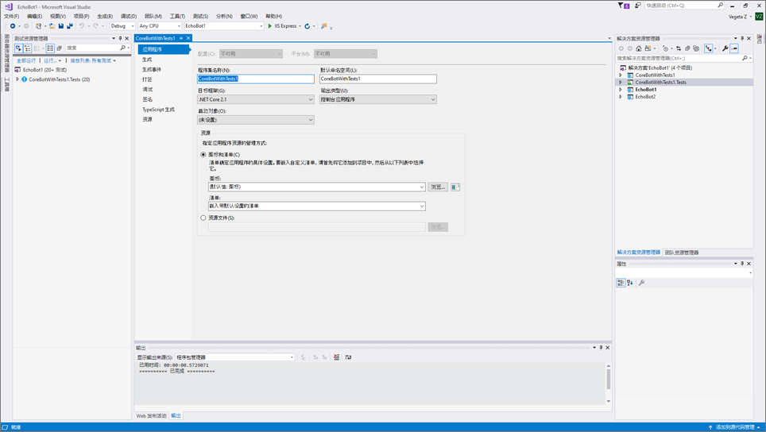
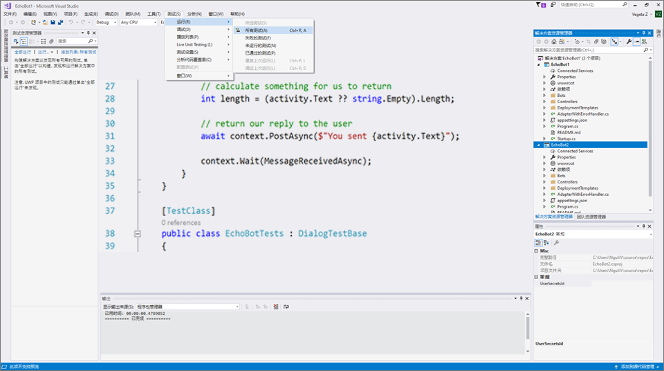

# 对机器人进行单元测试

## 1.	目标

使用 Microsoft Bot Framework 编写代码既有趣又令人振奋。但匆匆编写机器人代码之前，你需要考虑对代码进行单元测试。聊天机器人为测试带来了一系列特有的挑战，包括跨环境测试、集成第三方 API 等。单元测试是一种软件测试方法，它会测试软件应用程序的各个单元/组件。

单元测试有助于：

* 添加功能时对其进行验证
* 单独验证各组件
* 不熟悉你的代码的人确认在使用代码时未损坏代码

本实验的目标是为使用 Microsoft Bot Framework 开发的机器人引入单元测试。

## 2.	设置

从 code\EchoBot 导入 VisualStudio 中的 EchoBot 解决方案。成功导入后，你将看到两个项目：EchoBot（机器人应用程序）和 EchoBotTests（测试项目），如下所示。 



## 3.	Echobot

在本实验中，我们将使用 EchoBot 开发单元测试。EchoBot 是一种非常简单的机器人，将用户键入的任何消息都向用户发送回去。例如，如果用户键入“你好”，EchoBot 回复消息“你发送的是：你好”。使用对话的 EchoBot 代码的核心可以在下面找到 (MessagesController.cs)。MessageReceivedAsync 回复用户“你说的是：”

````c#
public class EchoDialog : IDialog<object>
{
    public async Task StartAsync(IDialogContext context)
    {
        context.Wait(MessageReceivedAsync);
    }

public async Task MessageReceivedAsync(IDialogContext context, IAwaitable<IMessageActivity> argument)
    {
        var message = await argument;
        await context.PostAsync("You said: " + message.Text);
        context.Wait(MessageReceivedAsync);
    }
}
````

## 4.	Echobot - 单元测试

对于复杂的聊天机器人，你需要担心对话状态和对话流。还有一个事实是：聊天机器人可多次响应一条用户消息；并且在发送消息后，你不会立即得到回答。鉴于存在上述复杂因素，可通过模拟帮助单元测试。模拟主要用于单元测试中。受测对象可能依赖其他（复杂）对象。要隔离待测对象的行为，你可以用模拟对象（模拟真实对象的行为）代替其他对象。如果将真实对象纳入单元测试是不切实际的，那么这样做非常有用。

可以使用 EchoBot 解决方案中的 Visual Studio *单元测试项目创建单元测试*。导入 EchoBot.sln 时，你将看到 EchoBotTests 项目，它是一个单元测试项目。该项目包含一些帮助程序类（这些类是通过重用 Bot Builder 代码开发的），用于帮助开发用于对话的单元测试：

* DialogTestBase.cs
* FiberTestBase.cs
* MockConnectorFactory.cs

在 EchoBotTests.cs 中有一个名为 *ShouldReturnEcho* 的 TestMethod。*ShouldReturnEcho* 验证来自 EchoBot 的结果。EchoBotTests.cs 中的以下行使用 RootDialog 来模拟 EchoBot 的行为。RootDialog 用于提供 EchoBot 的功能。

````c#
using (new FiberTestBase.ResolveMoqAssembly(rootDialog))
````

如下所示，通过选择 **“测试”->“运行”->“所有测试”** 来运行所有测试，并验证测试是否成功运行。



## 5.	提早完成？试试下面的练习，获得额外加分：

A. 另外编写一个名为 *EchoStartsWith* 的 TestMethod，它验证回声提示是否以“你发送的是”开头。

*提示：* TestMethod 与 ShouldReturnEcho() 非常相似，你应检查 toUser.Text 是否以“你发送的是”开头。 

B. 你能否验证复述的消息是由机器人发送的？

*提示：* 这将涉及查看收到的 IMessageActivity 响应的属性。


### 继续学习 [3_Direct_Line_测试](3_Direct_Line_Testing.md)

 返回 [README](../0_README.md)