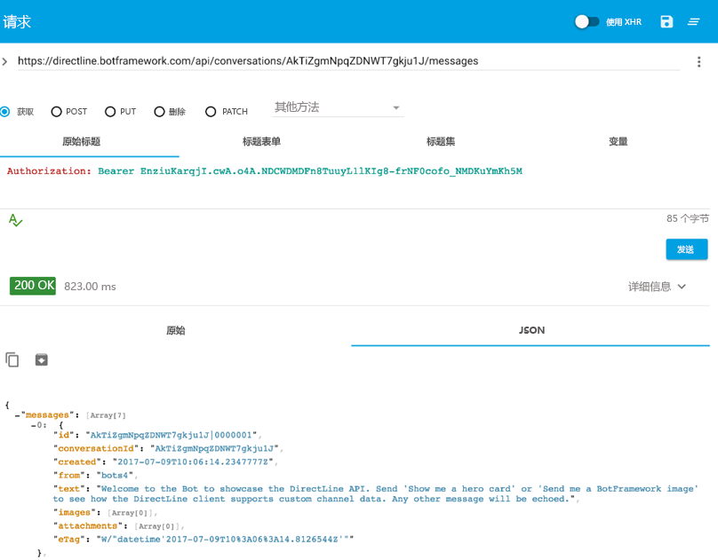

# 直接连接机器人 - Direct Line

## 目标

在某些情况下，可能需要直接与机器人通信。例如，你可能希望使用托管的机器人执行功能测试。可以使用 [Direct Line API](https://docs.microsoft.com/zh-cn/bot-framework/rest-api/bot-framework-rest-direct-line-3-0-concepts) 来执行机器人与你自己的客户端应用程序之间的通信。此动手实验引入了与 Direct Line API 相关的主要概念。

## 设置

1. 从 code\core-DirectLine 打开项目，并导入 Visual Studio 中的解决方案。

2. 在 DirectLineBot 解决方案中，你将找到两个项目：DirectLineBot 和 DirectLineSampleClient。你可以选择使用 **发布的机器人（来自之前的实验）**，也可以为本实验 **发布 DirectLineBot**。

要使用 DirectLineBot，你必须：

- 将它部署到 Azure。请按照[本教程](https://docs.microsoft.com/zh-cn/bot-framework/deploy-dotnet-bot-visual-studio) 操作，了解如何将 .NET 机器人直接从 Visual Studio 部署到 Azure。

- 在门户中注册 DirectLineBot，这样其他人才可以使用。[注册说明](https://docs.microsoft.com/zh-cn/bot-framework/portal-register-bot) 中提供了注册的相关步骤。


DirectLineSampleClient 是将消息发送到机器人的客户端。

## 身份验证

使用从 Azure 门户中的“Direct Line 通道配置”页获取的机密，即可对 Direct Line API 请求进行身份验证。转到 Azure 门户并找到自己的机器人。在“机器人管理”下选择 **“通道”**，然后选择“Direct Line”，即可添加 Direct Line。在“Direct Line 配置通道”页上选择“显示”并复制密钥，就能获得密钥。


**安全范围**

密钥：密钥适用于整个应用程序范围，嵌入在客户端应用程序中。由应用程序发起的每个对话都使用相同的机密。这样非常方便。

令牌：令牌特定于对话。你使用该机密请求令牌，并且可以使用该令牌发起对话。自发布开始，它的有效期为 30 分钟，可以刷新它。

## Web 配置

然后，应将从 Azure 门户中的 *配置 Direct Line* 获取的密钥添加到已发布机器人的 Web.config 文件中的“配置”设置中。此外，你还需要捕获并添加机器人 ID（也称为机器人句柄）、应用密码和应用 ID，并输入 DirectLineSampleClient 项目中 App.config 的 appSettings 部分。要在 App.config 中输入/编辑的 Web.config 相关行如下所列：

```csharp
<add key="DirectLineSecret" value="YourBotDirectLineSecret" />
<add key="BotId" value="YourBotId/" />
<add key="MicrosoftAppId" value="YourAppId" />
<add key="MicrosoftAppPassword" value="YourAppPassword" />
```

## 发送和接收消息

使用 Direct Line API，客户端可以通过发出 HTTP Post 请求向机器人发送消息。还可以通过 WebSocket 流或发出 HTTP GET 请求来接收来自机器人的消息。在本实验中，我们将了解如何使用 HTTP Get 选项接收消息。

1.	更改配置后，运行项目 DirectLineSampleClient。

2.	通过控制台提交消息并获取对话 ID。Program.cs 的第 52 行打印出与机器人对话所需的对话 ID：

	````Console.WriteLine("Conversation ID:"+ conversation.ConversationId);````

	

3.	获得对话 ID 后，便可使用 HTTP Get 检索用户和机器人的消息。要检索特定对话的消息，你可以向 https://directline.botframework.com/api/conversations/{conversationId}/messages 终结点发出 GET 请求。你还需要将密钥作为原始标头（即 Authorization: Bearer {secretKey}）的一部分传递。

4.	任何 REST 客户端都可用于通过 HTTP Get 接收消息。在本实验中，我们将使用 curl 或基于 Web 的客户端：

	4.1 Curl：

	Curl 是一种使用各种协议传输数据的命令行工具。可从以下位置下载 curl 	
	https://curl.haxx.se/download.html

	打开终端并转到安装 curl 的位置，然后为特定对话运行以下命令：
		
	```
	curl -H "Authorization:Bearer {SecretKey}" https://directline.botframework.com/api/conversations/{conversationId}/messages -XGET
	```

	


	4.2 基于 Web 的 REST 客户端：

	你可以使用 Chrome 的[高级 REST 客户端](https://advancedrestclient.com/)接收来自机器人的消息。 
	
	要使用高级 REST 客户端，标头需要包含标头名称 (Authorization) 和标头值 (Bearer SecretKey)。请求 URL 为 https://directline.botframework.com/api/conversations/{conversationId}/messages 终结点
	
	下图表示从 *高级 Rest 客户* 端获得的对话。请注意对话“你好”以及发送回来的相应机器人响应。

	

	&nbsp;

	

5.	Direct Line API 3.0

	不同于更低的版本，使用 3.0 版，你还可以发送图像或英雄卡等各种媒体。如果使用 DirectLineBotDialog.cs，其中某个 case 语句查找文本“send me a botframework image”以发送图像

```c#
	案例“send me a botframework image”：
						
		reply.Text = $"Sample message with an Image attachment";

			var imageAttachment = new Attachment()
			{
			ContentType = "image/png",
					ContentUrl = "https://docs.microsoft.com/zh-cn/bot-framework/media/how-it-works/architecture-resize.png",
			};

		reply.Attachments.Add(imageAttachment);
```

	使用客户端输入此文本，并通过 curl 查看结果，如下所示。你将在图像数组中找到显示的图像 URL。

	

	
### 继续查看[README](../0_README.md)以查看实验